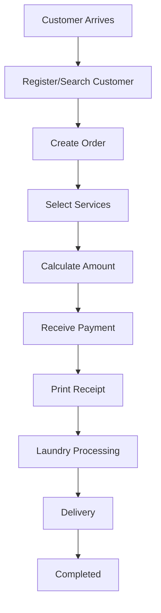

# Product Requirements Document (PRD)
## KleanFlow Laundry Pickup & Delivery Management System

**Version:** 1.0  
**Status:** Draft Approved  
**Stack:** Flask + MySQL + Bootstrap 5

---

# 1. Executive Summary

KleanFlow is a web application that digitizes the daily operations of small and medium-sized laundry businesses. It manages customers, laundry orders, services, pickup & delivery, payments, receipts, and reports.

---

# 2. Problem Statement

Many laundries rely on notebooks and WhatsApp to track customer orders, payments, and deliveries, resulting in:
- Lost records
- Payment disputes
- Delayed deliveries
- Poor reporting
- Inefficient customer service

---

# 3. Product Vision

Build a modern, easy-to-use laundry management platform with commercial quality while remaining suitable for deployment by a solo developer.

---

# 4. Objectives

- Replace paper records.
- Improve order tracking.
- Reduce payment errors.
- Generate printable receipts.
- Provide business reports.
- Support pickup and delivery workflows.

---

# 5. Stakeholders

- Business Owner
- Manager
- Cashier
- Laundry Staff
- Delivery Rider
- Customer
- System Administrator

---

# 6. User Roles

## Administrator
Full system access.

## Manager
Manage operations and reports.

## Cashier
Create orders, receive payments, print receipts.

## Laundry Staff
Update processing stages.

## Delivery Staff
Manage pickups and deliveries.

---

# 7. Scope

## In Scope

- Authentication
- Customer Management
- Laundry Services
- Order Management
- Pickup Scheduling
- Delivery Scheduling
- Payment Recording
- Receipt Printing
- Reports
- Dashboard
- User Management

## Out of Scope

- SMS
- Mobile App
- AI Features
- Real-time GPS Tracking

---

# 8. Functional Requirements

## Authentication
- Login
- Logout
- Forgot Password
- Change Password

## Customer Module
- Register Customer
- Edit Customer
- View History
- Search Customer

## Services
- Create Service
- Edit Pricing
- Activate/Deactivate

## Orders
- Create Order
- Add Items
- Assign Services
- Calculate Total
- Track Status

Statuses:
- Pending
- Picked Up
- Washing
- Drying
- Ironing
- Ready
- Out for Delivery
- Completed
- Cancelled

## Payments
- Cash
- Mobile Money
- Card (Test)
- Partial Payment
- Balance Tracking

## Receipts
- Print Receipt
- Reprint Receipt
- Unique Receipt Number

## Reports
- Daily Sales
- Monthly Sales
- Orders by Status
- Top Customers
- Revenue Summary

---

# 9. Non-Functional Requirements

- Responsive UI
- Secure Authentication
- Fast Search
- MySQL Database
- Maintainable Code
- Modular Architecture

---

# 10. Business Workflow

---

# 11. User Stories

- As a cashier, I want to register customers quickly.
- As a manager, I want daily sales reports.
- As a rider, I want to see assigned deliveries.
- As a customer, I want an accurate receipt.
- As an admin, I want to manage staff accounts.

---

# 12. Business Rules

- Receipt numbers must be unique.
- Completed orders cannot be edited.
- Cancelled orders remain in history.
- Every payment has a transaction reference.
- Services use configurable prices.

---

# 13. Success Metrics

- Order creation < 2 minutes.
- Receipt generated instantly.
- Dashboard loads < 2 seconds.
- Accurate daily reports.
- Zero duplicate receipt numbers.

---

# 14. Future Enhancements

- SMS Notifications
- Customer Portal
- QR Receipt Verification
- Inventory Module
- Expense Tracking
- Multi-Branch Support
- SaaS Multi-Tenant Edition

---

# 15. Acceptance Criteria

The MVP is complete when:
- Users authenticate securely.
- CRUD works for all major modules.
- Orders flow from creation to completion.
- Payments are recorded.
- Receipts print correctly.
- Reports display accurate business data.
- Role-based access is enforced.
