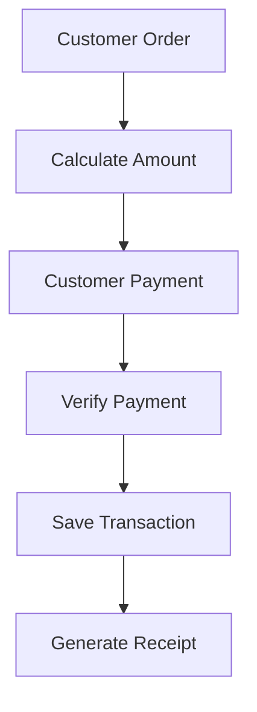
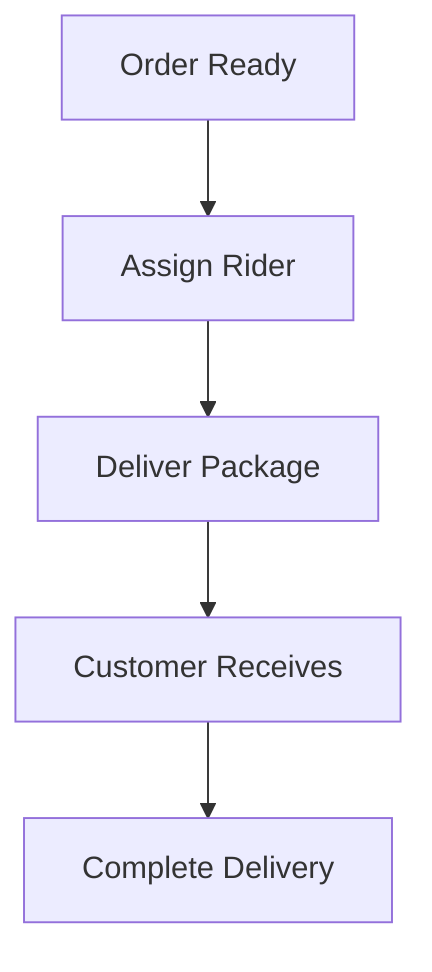

# Software Requirements Specification (SRS)

# KleanFlow Laundry Pickup & Delivery Management System

---

# Document Information

| Field                         | Details                                               |
| ----------------------------- | ----------------------------------------------------- |
| Document Name                 | Software Requirements Specification                   |
| Project Name                  | KleanFlow Laundry Pickup & Delivery Management System |
| Version                       | 1.0                                                   |
| Status                        | Approved Draft                                        |
| Document Type                 | Software Engineering Specification                    |
| Backend Technology            | Python Flask                                          |
| Database Technology           | MySQL 8                                               |
| Frontend Technology           | HTML5, CSS3, Bootstrap 5, JavaScript                  |
| Prepared For                  | Development and AI Implementation                     |
| Primary Development Assistant | Antigravity AI                                        |

---

# Revision History

| Version | Date | Description          | Author     |
| ------- | ---- | -------------------- | ---------- |
| 1.0     | 2026 | Initial SRS creation | Kingenious |

---

# Table of Contents

1. Introduction
2. Purpose
3. Scope
4. System Overview
5. Product Perspective
6. User Classes and Roles
7. Functional Requirements
8. Non-Functional Requirements
9. Security Requirements
10. Database Requirements
11. Integration Requirements
12. System Constraints
13. Assumptions
14. Acceptance Criteria
15. Future Enhancements

---

# 1. Introduction

## 1.1 Background

Small and medium-sized laundry businesses often rely on manual processes such as notebooks, spreadsheets, phone messages, and verbal communication to manage customer orders.

These approaches create operational problems including:

- Lost customer records.
- Difficulty tracking laundry progress.
- Payment disputes.
- Poor delivery coordination.
- Lack of business reports.
- Inefficient customer service.

KleanFlow provides a centralized digital platform that allows laundry businesses to manage their operations efficiently.

---

# 2. Purpose

The purpose of this Software Requirements Specification is to define the complete requirements of the KleanFlow Laundry Pickup & Delivery Management System.

This document describes:

- System features.
- User interactions.
- Functional requirements.
- Technical requirements.
- Security requirements.
- Business rules.
- System limitations.

This document will guide:

- Developers.
- AI coding assistants.
- Testers.
- Future maintainers.

---

# 3. Scope

## 3.1 System Scope

KleanFlow is a web-based laundry management application that enables businesses to:

- Manage customers.
- Create laundry orders.
- Track order progress.
- Manage services and pricing.
- Record payments.
- Generate receipts.
- Coordinate pickup and delivery.
- Generate business reports.

---

# 3.2 In Scope

The first version of KleanFlow shall include:

## Authentication

- User registration.
- Login.
- Logout.
- Password management.
- Role-based access.

## Customer Management

- Customer registration.
- Customer profiles.
- Customer search.
- Customer order history.

## Service Management

- Create laundry services.
- Update pricing.
- Enable/disable services.

## Order Management

- Create orders.
- Update order status.
- Assign processing staff.
- Track completion.

## Payment Management

- Record payments.
- Track balances.
- Generate payment records.

## Receipt Management

- Generate receipts.
- Print receipts.
- View previous receipts.

## Pickup and Delivery

- Schedule pickups.
- Assign delivery staff.
- Track delivery status.

## Reporting

- Sales reports.
- Order reports.
- Customer reports.

---

# 3.3 Out of Scope

The following features are excluded from version 1.0:

- Native Android/iOS application.
- Artificial intelligence recommendations.
- Automatic SMS gateway.
- Real-time GPS tracking.
- Advanced accounting.
- Multi-company SaaS billing.
- Warehouse inventory management.

---

# 4. System Overview

## 4.1 System Description

KleanFlow follows a web application architecture where users interact with the system through a browser.

The application consists of:

```
User Browser

↓

Flask Web Application

↓

Business Logic Layer

↓

Database Layer

↓

MySQL Database
```

---

# 4.2 Main System Objectives

The system shall:

- Digitize laundry operations.
- Reduce manual paperwork.
- Improve order visibility.
- Increase payment accuracy.
- Improve customer experience.
- Provide operational insights.

---

# 5. Product Perspective

## 5.1 Product Context

KleanFlow is designed as a standalone business management system.

Future versions may support:

- Multiple businesses.
- Subscription accounts.
- Cloud hosting.
- Customer portals.

---

# 5.2 Operating Environment

## Hardware Requirements

Minimum:

- Dual-core processor.
- 4GB RAM.
- 5GB storage.

Recommended:

- Modern laptop/desktop.
- 8GB RAM.
- Stable internet connection.

---

## Software Requirements

Development:

- Python 3.13+
- MySQL 8+
- Flask
- Web browser.

Production:

- Linux/Windows server.
- Web server.
- MySQL database.

---

# 6. User Classes and Roles

The system supports multiple user categories.

---

# 6.1 Administrator

## Description

The administrator manages the entire system.

## Responsibilities

- Manage employees.
- Configure settings.
- Manage services.
- View reports.
- Maintain security.

## Permissions

| Action          | Permission |
| --------------- | ---------- |
| Manage users    | Yes        |
| Manage services | Yes        |
| View reports    | Yes        |
| Modify settings | Yes        |
| Delete records  | Yes        |

---

# 6.2 Manager

## Description

Responsible for monitoring business operations.

## Permissions

| Action           | Permission |
| ---------------- | ---------- |
| View dashboard   | Yes        |
| Manage orders    | Yes        |
| View reports     | Yes        |
| Manage customers | Yes        |

---

# 6.3 Cashier

## Description

Handles customer transactions.

## Permissions

| Action          | Permission |
| --------------- | ---------- |
| Create customer | Yes        |
| Create order    | Yes        |
| Receive payment | Yes        |
| Print receipt   | Yes        |

---

# 6.4 Laundry Staff

## Description

Handles laundry processing.

## Permissions

| Action                | Permission |
| --------------------- | ---------- |
| View assigned orders  | Yes        |
| Update laundry status | Yes        |
| View customer payment | Limited    |

---

# 6.5 Delivery Staff

## Description

Handles pickup and delivery.

## Permissions

| Action                   | Permission |
| ------------------------ | ---------- |
| View assigned deliveries | Yes        |
| Update delivery status   | Yes        |

---

# 7. Functional Requirements

# FR-001 Authentication Module

## Description

The system shall provide secure authentication functionality.

## Features

The system shall allow users to:

- Login.
- Logout.
- Change passwords.
- Recover accounts.

---

## Inputs

- Email/Username.
- Password.

---

## Outputs

Successful login:

```
Redirect user to dashboard
```

Failed login:

```
Display authentication error
```

---

## Business Rules

- Passwords must never be stored as plain text.
- Only active users can login.
- Users must have assigned roles.

---

# FR-002 User Management Module

## Description

Administrators shall manage employee accounts.

---

## User Information

The system shall store:

- Full name.
- Email.
- Phone number.
- Role.
- Password hash.
- Account status.
- Created date.

---

## CRUD Operations

Create:

- Add employee.

Read:

- View employees.

Update:

- Edit employee details.

Delete:

- Deactivate employee.

---

# END OF PART 1

```markdown
# 7. Functional Requirements (Continued)

---

# FR-003 Customer Management Module

## Description

The system shall provide functionality for managing laundry customers and their information.

The customer module acts as the central record system for all customer-related activities.

---

## Customer Data Requirements

The system shall store:

| Field | Description |
|---|---|
| Customer ID | Unique customer identifier |
| Full Name | Customer legal name |
| Phone Number | Contact number |
| Email | Optional email address |
| Address | Pickup/delivery location |
| Registration Date | Date customer joined |
| Status | Active or inactive |

---

## Customer Functions

### Create Customer

The system shall allow authorized users to register new customers.

Required information:

- Full name
- Phone number
- Address

---

### View Customer

Users shall be able to:

- View customer profile.
- View previous orders.
- View payment history.

---

### Search Customer

The system shall support searching by:

- Customer name.
- Phone number.
- Customer ID.

---

### Update Customer

Authorized users shall be able to update:

- Contact information.
- Address.
- Customer status.

---

### Delete Customer

Customers shall not be permanently deleted.

The system shall support:

- Soft deletion.
- Account deactivation.

---

## Customer Acceptance Criteria

A customer module is complete when:

- Users can create customers.
- Customers appear in the customer list.
- Search functionality works.
- Customer history is accessible.
- Unauthorized users cannot modify records.

---

# FR-004 Laundry Service Management Module

## Description

The system shall allow administrators to manage available laundry services and pricing.

---

## Service Examples

- Washing
- Dry Cleaning
- Ironing
- Folding
- Express Laundry
- Pickup Service
- Delivery Service

---

## Service Data Requirements

| Field | Description |
|-|-|
| Service ID | Unique identifier |
| Service Name | Name of service |
| Description | Service details |
| Price | Service cost |
| Status | Active/Inactive |
| Created Date | Creation timestamp |

---

## Service CRUD Operations

## Create Service

Administrator can add new services.

Example:

```

Service:
Premium Washing

Price:
GH₵20

````

---

## Read Service

Users can view available services.

---

## Update Service

Administrator can:

- Change pricing.
- Update description.
- Change availability.

---

## Delete Service

Services should be deactivated instead of permanently removed.

---

## Service Acceptance Criteria

The module is complete when:

- Administrators can manage services.
- Prices update correctly.
- Orders can use active services only.

---

# FR-005 Laundry Order Management Module

## Description

The order module manages the complete lifecycle of customer laundry requests.

---

# Order Creation Workflow

```mermaid
flowchart TD

A[Customer Selected]

B[Select Laundry Services]

C[Enter Clothing Details]

D[Calculate Total Cost]

E[Create Order]

F[Receive Payment]

G[Generate Receipt]

A --> B --> C --> D --> E --> F --> G
````

---

# Order Information

The system shall store:

| Field        | Description       |
| ------------ | ----------------- |
| Order ID     | Unique identifier |
| Customer ID  | Related customer  |
| Service ID   | Selected services |
| Quantity     | Number of items   |
| Description  | Clothing details  |
| Total Amount | Complete cost     |
| Paid Amount  | Amount received   |
| Balance      | Remaining amount  |
| Status       | Processing stage  |
| Created Date | Order date        |

---

# Order Status Lifecycle

An order shall move through these stages:

```
Pending

↓

Picked Up

↓

Washing

↓

Drying

↓

Ironing

↓

Ready

↓

Out For Delivery

↓

Completed
```

---

## Cancelled Orders

Orders may be cancelled only before completion.

Cancelled orders must remain stored for records.

---

# Order Functions

## Create Order

Authorized users can:

* Select customer.
* Select services.
* Add item details.
* Calculate price.

---

## View Orders

Users can:

* View current orders.
* Filter by status.
* Search orders.

---

## Update Order

Authorized staff can:

* Change status.
* Assign staff.
* Update processing information.

---

## Delete Order

Orders shall not be permanently deleted.

The system shall use:

* Cancellation status.
* Audit history.

---

# Order Acceptance Criteria

The order module is complete when:

* Orders can be created.
* Prices calculate correctly.
* Status updates work.
* Order history is available.
* Completed orders are protected.

---

# FR-006 Payment Management Module

## Description

The payment module manages all financial transactions related to laundry services.

---

# Supported Payment Methods

The system shall support:

* Cash payment.
* Mobile Money recording.
* Card payment simulation.
* API payment integration.

---

# Payment Information

| Field                 | Description        |
| --------------------- | ------------------ |
| Payment ID            | Unique identifier  |
| Order ID              | Related order      |
| Amount                | Paid amount        |
| Payment Method        | Payment channel    |
| Transaction Reference | Payment identifier |
| Payment Status        | Completed/Pending  |
| Payment Date          | Transaction date   |

---

# Payment Workflow



---

# Payment Rules

* Every payment must have a unique reference.
* Payments cannot exceed order total.
* Partial payments must track outstanding balance.
* Completed payments cannot be modified without authorization.

---

# Payment Acceptance Criteria

The payment system is complete when:

* Payments can be recorded.
* Payment history is visible.
* Balances calculate correctly.
* Receipts show payment information.

---

# FR-007 Receipt Management Module

## Description

The system shall generate professional receipts for customers.

---

# Receipt Information

Receipts shall contain:

```
Business Name

Receipt Number

Customer Name

Order Number

Services

Amount Paid

Balance

Payment Method

Date

Staff Name
```

---

# Receipt Features

The system shall support:

* Receipt generation.
* Receipt preview.
* Printing.
* Reprinting previous receipts.

---

# Receipt Rules

* Every receipt must have a unique number.
* Receipts cannot be duplicated.
* Receipt history must remain available.

---

# Receipt Acceptance Criteria

The receipt module is complete when:

* Receipts generate automatically.
* Printed receipts contain accurate information.
* Previous receipts can be retrieved.

---

# FR-008 Pickup Management Module

## Description

The system shall support customer laundry pickup scheduling.

---

# Pickup Information

| Field          | Description                |
| -------------- | -------------------------- |
| Pickup ID      | Unique identifier          |
| Customer       | Customer requesting pickup |
| Address        | Pickup location            |
| Date           | Scheduled date             |
| Assigned Staff | Pickup employee            |
| Status         | Pickup progress            |

---

# Pickup Status

```
Requested

↓

Assigned

↓

Collected

↓

Completed
```

---

# Pickup Acceptance Criteria

The module is complete when:

* Pickups can be created.
* Staff can be assigned.
* Pickup status can change.

---

# FR-009 Delivery Management Module

## Description

The system shall manage delivery of completed laundry orders.

---

# Delivery Information

| Field            | Description       |
| ---------------- | ----------------- |
| Delivery ID      | Unique identifier |
| Order ID         | Related order     |
| Customer Address | Delivery location |
| Assigned Rider   | Delivery employee |
| Delivery Date    | Scheduled date    |
| Status           | Delivery progress |

---

# Delivery Workflow



---

# Delivery Status

```
Waiting

↓

Assigned

↓

Out For Delivery

↓

Delivered
```

---

# Delivery Acceptance Criteria

The module is complete when:

* Deliveries can be assigned.
* Riders can view tasks.
* Delivery completion is recorded.

---

# END OF PART 2


```markdown
# FR-010 Reporting & Analytics Module

## Description

The Reporting Module provides business intelligence by generating operational and financial reports for managers and administrators.

Reports shall be generated from live business data stored in the database.

---

## Report Categories

### Sales Reports

The system shall generate:

- Daily Sales
- Weekly Sales
- Monthly Sales
- Yearly Sales
- Custom Date Range Sales

---

### Order Reports

The system shall generate:

- Pending Orders
- Completed Orders
- Cancelled Orders
- Orders in Progress
- Pickup Orders
- Delivery Orders

---

### Customer Reports

The system shall generate:

- Total Customers
- New Customers
- Returning Customers
- Top Customers
- Customer Spending

---

### Financial Reports

The system shall generate:

- Total Revenue
- Outstanding Balances
- Completed Payments
- Pending Payments
- Payment Method Summary

---

### Operational Reports

The system shall generate:

- Laundry Workload
- Pickup Performance
- Delivery Performance
- Staff Activity Summary

---

## Report Features

The system shall allow users to:

- Search reports
- Filter reports
- Export reports
- Print reports

---

## Acceptance Criteria

The reporting module is complete when:

- Reports generate correctly.
- Filters work correctly.
- Totals are accurate.
- Reports can be printed.

---

# FR-011 Dashboard Module

## Description

The Dashboard provides a quick overview of business operations.

It serves as the first page after login.

---

## Dashboard Cards

The dashboard shall display:

- Total Customers
- Total Orders
- Pending Orders
- Completed Orders
- Total Revenue
- Outstanding Balances
- Today's Sales
- Pickup Requests
- Delivery Requests

---

## Dashboard Charts

The dashboard shall include:

- Revenue Trend
- Orders Per Day
- Payment Methods
- Monthly Sales
- Order Status Distribution

---

## Dashboard Widgets

- Recent Orders
- Recent Payments
- Notifications
- Upcoming Deliveries
- Pickup Schedule

---

## Acceptance Criteria

The dashboard is complete when:

- Statistics update automatically.
- Charts display correctly.
- Data matches the database.

---

# FR-012 Notification Module

## Description

The notification module informs users about important events.

---

## Notification Types

- New Order
- Payment Received
- Pickup Assigned
- Delivery Assigned
- Order Completed
- Low Priority Alerts
- System Messages

---

## Notification Features

Users shall be able to:

- View notifications
- Mark notifications as read
- Delete notifications

---

# FR-013 Settings Module

## Description

Administrators shall configure application settings.

---

## Settings Categories

### Business Information

- Business Name
- Logo
- Address
- Phone Number
- Email

---

### Receipt Settings

- Receipt Prefix
- Footer Message
- Currency
- Tax Rate

---

### Payment Settings

- Enable Cash
- Enable Mobile Money
- Enable Card
- Paystack Test Keys

---

### User Settings

- Password Policy
- Session Timeout
- Default Role

---

### Appearance

- Light Theme
- Dark Theme
- Primary Color

---

# Acceptance Criteria

Settings are complete when:

- Changes save correctly.
- Settings affect the application immediately.
- Unauthorized users cannot modify settings.

---

# 8. Non-Functional Requirements

---

# NFR-001 Performance

The application shall:

- Load dashboard within 2 seconds.
- Load tables efficiently.
- Optimize database queries.
- Support pagination.
- Minimize page reloads.

---

# NFR-002 Reliability

The application shall:

- Prevent data loss.
- Handle unexpected errors gracefully.
- Maintain transaction integrity.
- Recover safely from failures.

---

# NFR-003 Scalability

The architecture shall support future expansion without major redesign.

Future support includes:

- Multiple branches
- Multiple businesses
- Cloud deployment
- Customer portal
- Mobile application

---

# NFR-004 Maintainability

Developers shall be able to:

- Add modules easily.
- Replace components independently.
- Update business rules.
- Extend functionality.

---

# NFR-005 Usability

The interface shall:

- Require minimal training.
- Use consistent layouts.
- Provide helpful validation messages.
- Support desktop and mobile devices.

---

# NFR-006 Availability

The application shall:

- Be available whenever the server is operational.
- Handle multiple simultaneous users.
- Maintain session integrity.

---

# NFR-007 Compatibility

Supported browsers:

- Google Chrome
- Microsoft Edge
- Mozilla Firefox
- Safari

---

# NFR-008 Accessibility

The application shall:

- Use readable fonts.
- Maintain sufficient color contrast.
- Provide descriptive labels.
- Support keyboard navigation where practical.

---

# 9. Security Requirements

The system shall:

- Hash passwords using Werkzeug.
- Validate every request.
- Enforce role-based authorization.
- Protect against SQL Injection using SQLAlchemy ORM.
- Enable CSRF protection.
- Validate uploaded files.
- Protect session cookies.
- Use secure environment variables.

---

# 10. Database Requirements

---

## Database Engine

MySQL 8+

---

## Major Tables

The application shall include at minimum:

- users
- roles
- customers
- services
- orders
- order_items
- payments
- receipts
- pickups
- deliveries
- notifications
- settings

---

## General Database Rules

Every table shall include:

- Primary Key
- Created At
- Updated At

Important tables should also include:

- Created By
- Updated By

Foreign keys shall be enforced.

---

# 11. Integration Requirements

External integrations may include:

## Payment

- Paystack Test API

---

## Email

Future:

- Gmail SMTP
- SendGrid

---

## PDF

Receipt generation:

- WeasyPrint
- ReportLab

---

## Charts

- Chart.js

---

# 12. Error Handling Requirements

The application shall:

- Display friendly error messages.
- Log unexpected exceptions.
- Prevent application crashes.
- Redirect unauthorized users.
- Validate all form submissions.

---

# 13. Audit Logging Requirements

The system shall log:

- User Login
- Failed Login
- User Logout
- Customer Creation
- Order Creation
- Payment Recording
- Receipt Generation
- Settings Changes
- User Management
- Administrative Actions

---

# 14. System Constraints

The project shall:

- Use Flask.
- Use SQLAlchemy ORM.
- Use MySQL.
- Use Bootstrap 5.
- Avoid unnecessary third-party packages.
- Maintain modular architecture.
- Remain suitable for deployment by a solo developer.

---

# 15. Assumptions

The project assumes:

- Users possess basic computer literacy.
- Internet access is available when required.
- Business staff receive basic training.
- Administrators maintain user accounts.
- Payment gateways are operational.

---

# 16. Risks

Potential risks include:

- Internet outages.
- Payment gateway downtime.
- User input errors.
- Hardware failure.
- Database corruption.
- Unauthorized access attempts.

---

# 17. Business Rules

The following business rules shall always apply.

## Customer Rules

- Customers may have multiple orders.
- Customers cannot share identical phone numbers.

---

## Order Rules

- Orders require an existing customer.
- Orders require at least one service.
- Completed orders cannot be edited.
- Cancelled orders remain stored.

---

## Payment Rules

- Payments cannot exceed total amount.
- Every payment requires a transaction reference.
- Payment history cannot be deleted.

---

## Receipt Rules

- Every receipt number must be unique.
- Receipts cannot be modified after generation.
- Receipts remain permanently available.

---

## Delivery Rules

- Orders must be marked "Ready" before delivery.
- Completed deliveries cannot be reassigned.

---

# 18. Acceptance Criteria

The software shall be accepted when:

- Authentication functions correctly.
- User roles enforce permissions.
- CRUD operations function for all modules.
- Orders follow the defined workflow.
- Payments calculate correctly.
- Receipts generate accurately.
- Reports display correct information.
- Dashboard statistics are accurate.
- Search and filters operate correctly.
- Security requirements are met.
- Responsive design functions on desktop and mobile.

---

# 19. Future Enhancements

Future releases may include:

- SaaS Multi-Tenant Architecture
- Customer Self-Service Portal
- QR Code Receipt Verification
- Mobile Application
- SMS Notifications
- WhatsApp Integration
- Barcode Labels
- Inventory Management
- Expense Management
- Employee Payroll
- Branch Management
- Customer Loyalty Program
- Online Booking
- Live Delivery Tracking
- API for Third-Party Integrations

---

# 20. Definition of Done

A module shall only be considered complete when:

- Database schema is implemented.
- SQLAlchemy models are created.
- CRUD operations function correctly.
- Input validation is implemented.
- Role-based authorization is enforced.
- User interface is responsive.
- Error handling is complete.
- Audit logging is implemented.
- Testing is completed.
- Documentation is updated.

---

# 21. Approval

| Field | Value |
|--------|-------|
| Project | KleanFlow Laundry Pickup & Delivery Management System |
| Document | Software Requirements Specification |
| Version | 1.0 |
| Status | Approved |
| Architecture | Flask + MySQL |
| Document Type | Software Requirements Specification (SRS) |

---

**End of Document**
```

```
```
