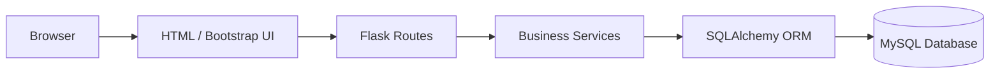
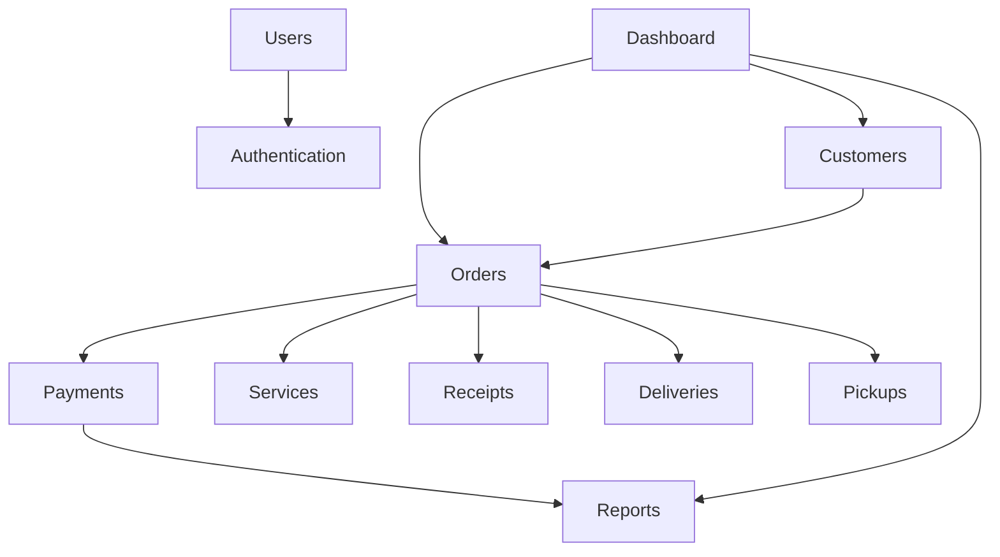
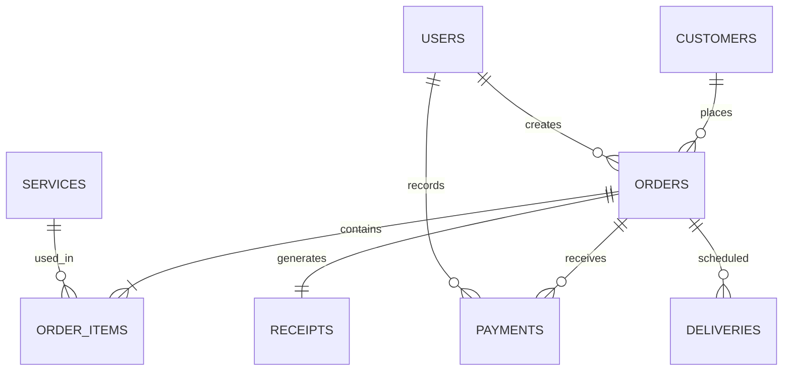
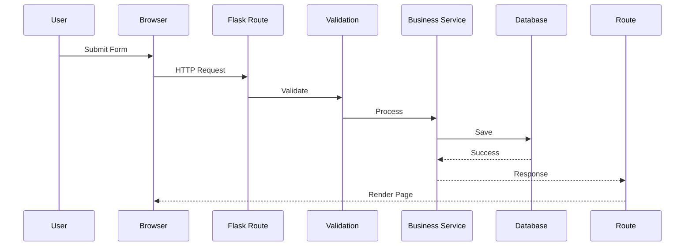

````markdown
# System Architecture Document

# KleanFlow Laundry Pickup & Delivery Management System

---

# Document Information

| Field | Value |
|--------|-------|
| Document Name | System Architecture Document |
| Project | KleanFlow Laundry Pickup & Delivery Management System |
| Version | 1.0 |
| Status | Approved |
| Architecture Style | Layered (3-Tier) Architecture |
| Backend | Python Flask |
| Database | MySQL 8 |
| Frontend | HTML5, Bootstrap 5, JavaScript |

---

# Table of Contents

1. Architecture Overview
2. Architectural Goals
3. Design Principles
4. High-Level Architecture
5. Layered Architecture
6. Application Components
7. Module Architecture
8. Database Architecture
9. Security Architecture
10. Request Lifecycle
11. Folder Structure
12. Deployment Architecture
13. Scalability Strategy
14. Error Handling
15. Logging Strategy
16. Future Architecture

---

# 1. Architecture Overview

KleanFlow follows a **Layered Three-Tier Architecture**.

The application separates the presentation layer, business logic layer, and data layer to improve maintainability, scalability, and testing.

The architecture is intentionally simple enough for a solo developer while remaining production-ready.

---

# 2. Architectural Goals

The architecture is designed to achieve the following goals:

- High maintainability
- Modular development
- Secure authentication
- Separation of concerns
- Easy testing
- Easy deployment
- Future scalability
- Reusable code

---

# 3. Design Principles

The application shall follow these engineering principles.

## Single Responsibility Principle (SRP)

Every module should have one responsibility.

Example:

- Customer Module
- Order Module
- Payment Module

Each performs only its own task.

---

## Don't Repeat Yourself (DRY)

Business logic should never be duplicated.

Reusable components should be shared across modules.

---

## Separation of Concerns

Business logic shall never exist inside HTML templates.

Templates display information only.

Flask routes receive requests.

Services process business rules.

Models communicate with the database.

---

## Modular Development

Every module shall be independent.

Adding a future Inventory Module must not require rewriting the Order Module.

---

# 4. High-Level Architecture



---

# 5. Layered Architecture

## Presentation Layer

Responsibilities

- HTML pages
- Bootstrap components
- Forms
- Dashboard
- Tables
- Charts

Technologies

- HTML5
- CSS3
- Bootstrap 5
- JavaScript
- Chart.js

---

## Application Layer

Responsibilities

- Receive HTTP requests
- Route requests
- Validate forms
- Handle sessions
- Authorization

Technologies

- Flask
- Flask Blueprints

---

## Business Logic Layer

Responsibilities

- Order calculations
- Business rules
- Payment validation
- Receipt generation
- Reports
- Notifications

No HTML should exist here.

---

## Data Layer

Responsibilities

- CRUD operations
- Relationships
- Database transactions

Technology

- SQLAlchemy ORM

---

## Database Layer

Technology

MySQL 8

Responsibilities

- Data persistence
- Foreign keys
- Constraints
- Indexes
- Transactions

---

# 6. Application Components

The system consists of the following modules.

```text
Authentication

Customer Management

User Management

Laundry Services

Orders

Payments

Receipts

Pickup

Delivery

Reports

Dashboard

Notifications

Settings
```

Each module shall function independently.

---

# 7. Component Relationships



---

# 8. Authentication Architecture

```mermaid
flowchart LR

User

↓

Login Form

↓

Authentication Service

↓

Password Verification

↓

Session Creation

↓

Dashboard
```

Passwords are hashed using Werkzeug.

Sessions are managed using Flask-Login.

---

# 9. Order Processing Architecture

```mermaid
flowchart TD

Customer

↓

Create Order

↓

Select Services

↓

Calculate Total

↓

Save Order

↓

Receive Payment

↓

Generate Receipt

↓

Laundry Processing

↓

Delivery

↓

Completed
```

---

# 10. Payment Architecture

Payment flow

```mermaid
flowchart TD

Order

↓

Payment Form

↓

Validation

↓

Payment Record

↓

Receipt

↓

Reports
```

Future integration:

- Paystack
- Stripe

Current implementation:

- Cash
- Mobile Money
- Test Card Payment

---

# 11. Reporting Architecture

Reports shall retrieve data directly from MySQL.

```mermaid
flowchart LR

Database

↓

SQLAlchemy

↓

Report Service

↓

Chart.js

↓

Dashboard
```

Reports shall never modify data.

---

# 12. Database Architecture

Major entities

```text
Users

Roles

Customers

Services

Orders

Order Items

Payments

Receipts

Pickup Requests

Deliveries

Notifications

Settings
```

Relationships



---

# 13. Folder Structure

```text
kleanflow/

│

├── app/

│ ├── auth/

│ ├── dashboard/

│ ├── customers/

│ ├── users/

│ ├── orders/

│ ├── services/

│ ├── payments/

│ ├── pickups/

│ ├── deliveries/

│ ├── reports/

│ ├── notifications/

│ ├── settings/

│ ├── models/

│ ├── templates/

│ ├── static/

│

├── migrations/

├── tests/

├── docs/

├── config.py

├── run.py

├── requirements.txt

└── README.md
```

---

# 14. Blueprint Architecture

Every feature shall use its own Flask Blueprint.

Example

```text
auth/

customers/

orders/

payments/

reports/
```

Advantages

- Independent modules
- Cleaner routing
- Easier maintenance

---

# 15. Security Architecture

Authentication

↓

Authorization

↓

Input Validation

↓

Business Logic

↓

Database

Security features

- Password hashing
- CSRF Protection
- SQLAlchemy ORM
- Secure sessions
- Role permissions

---

# 16. Request Lifecycle



---

# 17. Error Handling Strategy

Errors shall be handled at every layer.

Presentation Layer

- Friendly messages

Application Layer

- HTTP error pages

Business Layer

- Validation exceptions

Database Layer

- Transaction rollback

---

# 18. Logging Strategy

The application shall log:

- User login
- Failed login
- Customer creation
- Order creation
- Payment recording
- Receipt generation
- Report generation
- Settings modification
- System errors

Future:

- File logging
- Email alerts

---

# 19. Deployment Architecture

Development

```text
Browser

↓

Flask Development Server

↓

MySQL
```

Production

```text
Browser

↓

Nginx

↓

Gunicorn

↓

Flask

↓

MySQL
```

---

# 20. Scalability Strategy

Future improvements

- Multi-branch support
- SaaS multi-tenancy
- Docker containers
- Redis caching
- Background jobs
- REST API
- Mobile application
- Cloud deployment

---

# 21. Technology Stack

| Layer | Technology |
|---------|------------|
| Frontend | HTML5 |
| Styling | Bootstrap 5 |
| Icons | Bootstrap Icons |
| Charts | Chart.js |
| Backend | Flask |
| ORM | SQLAlchemy |
| Authentication | Flask-Login |
| Forms | Flask-WTF |
| Database | MySQL 8 |
| Migrations | Flask-Migrate |
| Environment | Python Dotenv |

---

# 22. Architectural Decisions

| Decision | Reason |
|-----------|--------|
| Flask | Lightweight and beginner-friendly |
| SQLAlchemy | Prevents SQL injection and simplifies CRUD |
| Bootstrap 5 | Responsive UI with minimal effort |
| Blueprints | Modular architecture |
| MySQL | Reliable relational database |
| Layered Architecture | Easy maintenance and scalability |

---

# 23. Future Architecture Roadmap

Version 2

- Customer Portal
- QR Receipt Verification
- Inventory Management
- Expense Tracking
- Employee Attendance

Version 3

- SaaS Multi-Tenant
- Online Payments
- Mobile App
- REST API
- AI Reports

---

# End of Document
````
