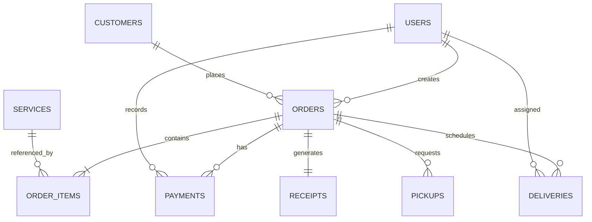

````markdown
# Database Design Document

# KleanFlow Laundry Pickup & Delivery Management System

---

# Document Information

| Field | Value |
|--------|-------|
| Document Name | Database Design Document |
| Project | KleanFlow Laundry Pickup & Delivery Management System |
| Version | 1.0 |
| Status | Approved |
| Database | MySQL 8 |
| ORM | SQLAlchemy |

---

# Table of Contents

1. Database Overview
2. Design Principles
3. Naming Conventions
4. Entity Relationship Diagram
5. Table Specifications
6. Relationships
7. Constraints
8. Indexing Strategy
9. Data Integrity Rules
10. Audit Strategy
11. Future Expansion

---

# 1. Database Overview

The KleanFlow database is designed using a normalized relational model to ensure:

- Data integrity
- Scalability
- Minimal redundancy
- Fast querying
- Easy maintenance

The schema follows **Third Normal Form (3NF)**.

---

# 2. Design Principles

The database shall follow these principles:

- Every table has a Primary Key.
- Foreign Keys enforce relationships.
- No duplicated business data.
- Soft deletes are preferred over permanent deletes.
- Every business record stores timestamps.
- Monetary values use DECIMAL, never FLOAT.

---

# 3. Naming Conventions

## Tables

Plural nouns.

Examples:

```text
users
customers
orders
payments
services
receipts
deliveries
```

---

## Columns

Snake case.

Examples

```text
first_name

phone_number

created_at

updated_at

payment_status
```

---

## Primary Keys

Every table:

```text
id
```

---

## Foreign Keys

Convention:

```text
customer_id

order_id

service_id

payment_id
```

---

# 4. Entity Relationship Diagram (ERD)



---

# 5. Table Specifications

---

# users

Stores employee accounts.

| Column | Type | Constraints |
|---------|------|-------------|
| id | BIGINT | PK |
| full_name | VARCHAR(120) | NOT NULL |
| email | VARCHAR(120) | UNIQUE |
| phone_number | VARCHAR(20) | UNIQUE |
| password_hash | VARCHAR(255) | NOT NULL |
| role | ENUM | NOT NULL |
| status | ENUM | Active/Inactive |
| created_at | DATETIME | |
| updated_at | DATETIME | |

---

# customers

Stores customer records.

| Column | Type |
|---------|------|
| id | BIGINT |
| customer_code | VARCHAR(30) |
| full_name | VARCHAR(120) |
| phone_number | VARCHAR(20) |
| email | VARCHAR(120) |
| address | TEXT |
| created_at | DATETIME |
| updated_at | DATETIME |

---

# services

Stores laundry services.

| Column | Type |
|---------|------|
| id | BIGINT |
| service_name | VARCHAR(120) |
| description | TEXT |
| price | DECIMAL(10,2) |
| status | ENUM |
| created_at | DATETIME |
| updated_at | DATETIME |

---

# orders

Stores laundry orders.

| Column | Type |
|---------|------|
| id | BIGINT |
| order_number | VARCHAR(50) |
| customer_id | BIGINT |
| total_amount | DECIMAL(10,2) |
| paid_amount | DECIMAL(10,2) |
| balance | DECIMAL(10,2) |
| payment_status | ENUM |
| order_status | ENUM |
| created_by | BIGINT |
| created_at | DATETIME |
| updated_at | DATETIME |

---

# order_items

Stores items inside an order.

| Column | Type |
|---------|------|
| id | BIGINT |
| order_id | BIGINT |
| service_id | BIGINT |
| clothing_type | VARCHAR(100) |
| quantity | INT |
| unit_price | DECIMAL(10,2) |
| subtotal | DECIMAL(10,2) |

---

# payments

Stores payment transactions.

| Column | Type |
|---------|------|
| id | BIGINT |
| order_id | BIGINT |
| payment_reference | VARCHAR(80) |
| payment_method | ENUM |
| amount | DECIMAL(10,2) |
| payment_status | ENUM |
| received_by | BIGINT |
| payment_date | DATETIME |

---

# receipts

Stores generated receipts.

| Column | Type |
|---------|------|
| id | BIGINT |
| receipt_number | VARCHAR(50) |
| order_id | BIGINT |
| payment_id | BIGINT |
| printed_at | DATETIME |

---

# pickups

Stores pickup requests.

| Column | Type |
|---------|------|
| id | BIGINT |
| order_id | BIGINT |
| assigned_staff | BIGINT |
| pickup_date | DATE |
| pickup_time | TIME |
| status | ENUM |

---

# deliveries

Stores delivery records.

| Column | Type |
|---------|------|
| id | BIGINT |
| order_id | BIGINT |
| assigned_staff | BIGINT |
| delivery_date | DATE |
| delivery_time | TIME |
| delivery_status | ENUM |

---

# notifications

Stores system notifications.

| Column | Type |
|---------|------|
| id | BIGINT |
| user_id | BIGINT |
| title | VARCHAR(150) |
| message | TEXT |
| is_read | BOOLEAN |
| created_at | DATETIME |

---

# settings

Stores application configuration.

| Column | Type |
|---------|------|
| id | BIGINT |
| business_name | VARCHAR(150) |
| business_phone | VARCHAR(20) |
| business_email | VARCHAR(120) |
| receipt_prefix | VARCHAR(20) |
| currency | VARCHAR(10) |
| tax_rate | DECIMAL(5,2) |

---

# 6. Relationships

## User → Orders

One user may create many orders.

```text
users (1)

↓

orders (Many)
```

---

## Customer → Orders

One customer may have multiple orders.

```text
customers (1)

↓

orders (Many)
```

---

## Order → Order Items

One order contains many clothing items.

```text
orders (1)

↓

order_items (Many)
```

---

## Services → Order Items

One service may appear in many order items.

---

## Order → Payments

One order may receive multiple payments.

Supports partial payments.

---

## Order → Receipt

One completed order generates one receipt.

---

## Order → Pickup

One order may have one pickup request.

---

## Order → Delivery

One order may have one delivery schedule.

---

# 7. Enumerations

## User Roles

```text
Administrator

Manager

Cashier

Laundry Staff

Delivery Staff
```

---

## Order Status

```text
Pending

Picked Up

Washing

Drying

Ironing

Ready

Out For Delivery

Completed

Cancelled
```

---

## Payment Status

```text
Pending

Partially Paid

Paid

Refunded
```

---

## Delivery Status

```text
Waiting

Assigned

Out For Delivery

Delivered

Cancelled
```

---

# 8. Constraints

The database shall enforce:

- Unique customer phone numbers.
- Unique user emails.
- Unique receipt numbers.
- Unique payment references.
- Foreign key integrity.
- Non-negative payment amounts.

---

# 9. Indexing Strategy

Create indexes on:

```text
customer_code

phone_number

email

order_number

receipt_number

payment_reference

created_at

order_status

payment_status
```

Purpose:

- Faster search
- Faster reports
- Better filtering

---

# 10. Data Integrity Rules

The system shall enforce:

- Orders cannot exist without a customer.
- Payments cannot exist without an order.
- Receipts require completed payment.
- Services must be active before selection.
- Completed orders become read-only.

---

# 11. Audit Fields

Every major table shall contain:

```text
created_at

updated_at
```

Recommended additional fields:

```text
created_by

updated_by
```

---

# 12. Soft Delete Strategy

Business records shall not be permanently deleted.

Use:

```text
is_deleted

deleted_at

deleted_by
```

instead of physical deletion where appropriate.

---

# 13. Backup Strategy

Recommended:

- Daily automated backups.
- Weekly full backup.
- Monthly archive.
- Restore testing every quarter.

---

# 14. Future Database Expansion

Future tables may include:

```text
inventory

expenses

vendors

branches

customer_feedback

employee_attendance

loyalty_points

discounts

coupons

api_tokens
```

---

# 15. Database Standards

- Use InnoDB engine.
- UTF8MB4 character set.
- Foreign key constraints enabled.
- Transactions for financial operations.
- SQLAlchemy ORM for all database access.
- Avoid raw SQL unless necessary for optimization.

---

# End of Document
````
